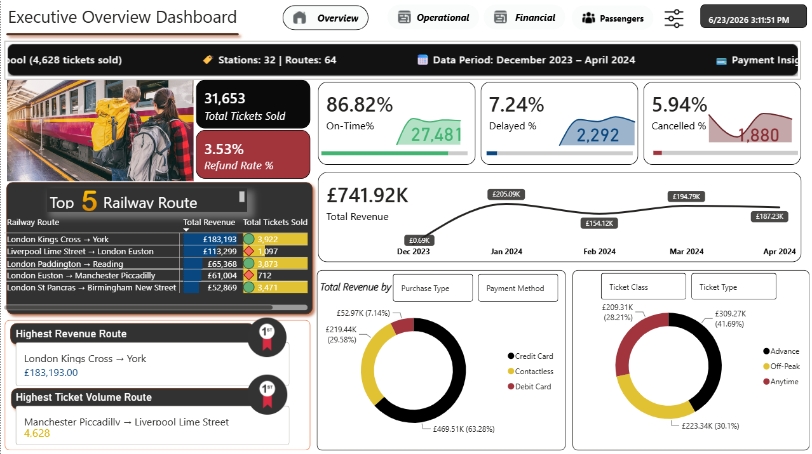
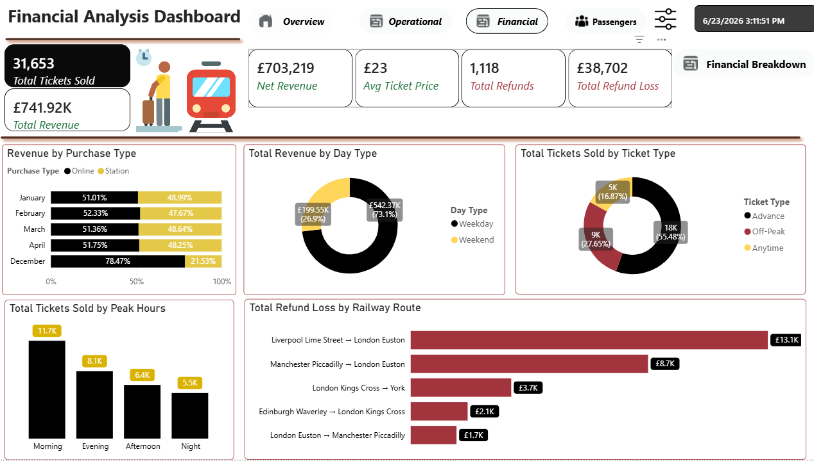
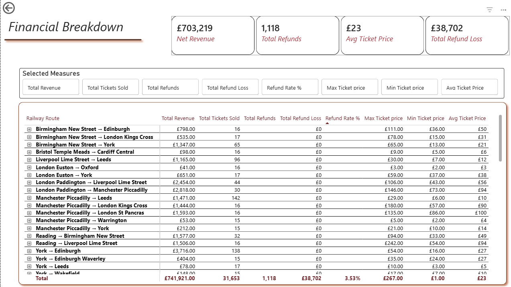
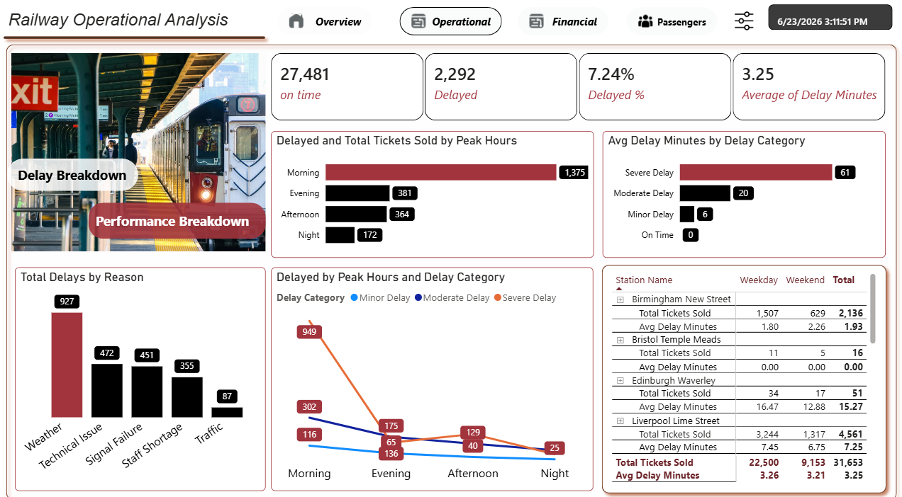
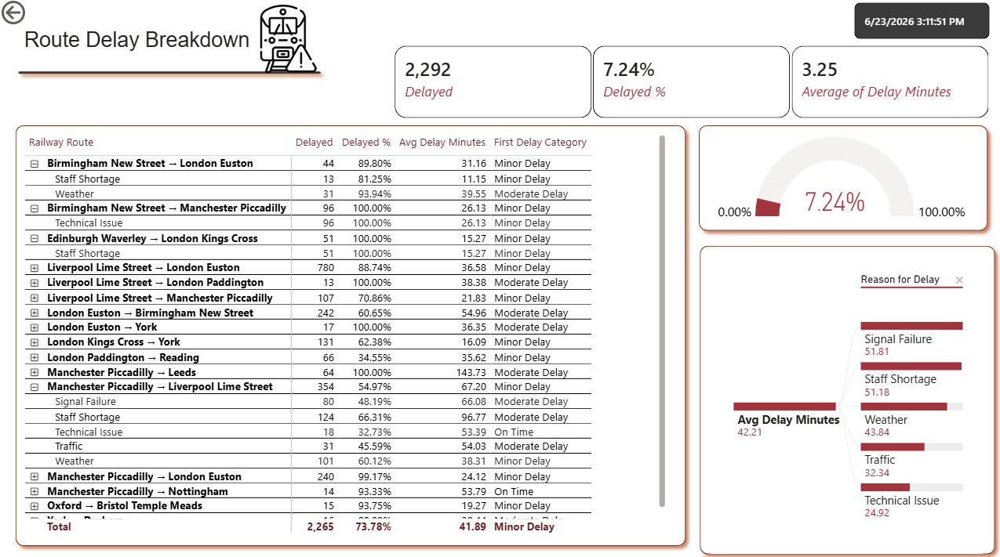
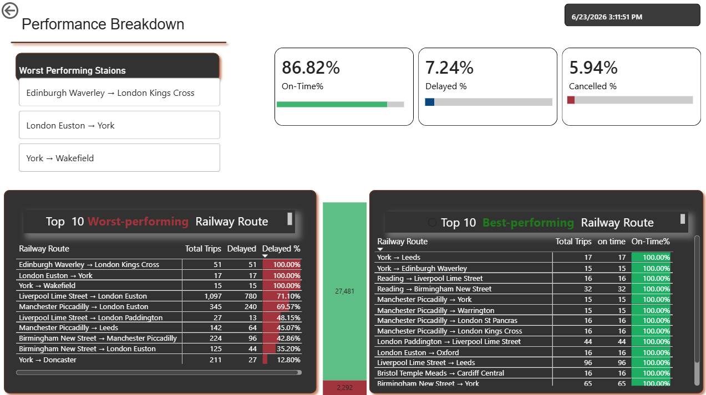
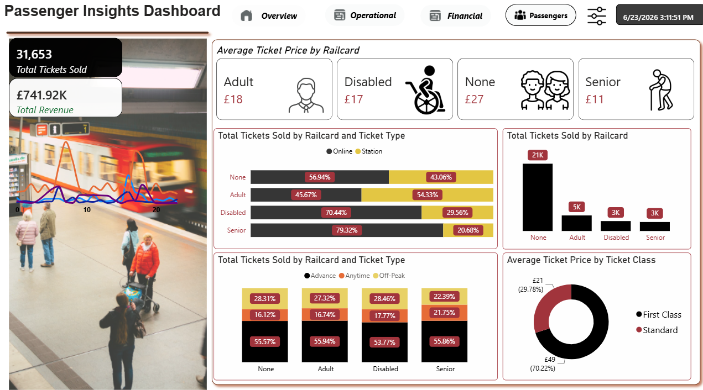

# 🚆 UK Railway Performance & Revenue Analytics Dashboard

## 📌 Project Overview

The UK Railway Performance & Revenue Analytics Dashboard is an interactive Power BI solution designed to provide comprehensive insights into railway operations, financial performance, and passenger behavior.

This dashboard helps railway stakeholders monitor service quality, identify revenue opportunities, analyze passenger trends, and make data-driven decisions through a centralized reporting platform.

---

## 📊 Dashboard Preview

### Executive Overview Dashboard



The Executive Overview page provides a summary of key business metrics including:

- Total Tickets Sold
- Revenue Performance
- On-Time Percentage
- Delay Percentage
- Cancellation Percentage
- Refund Rate
- Top Revenue Routes
- Ticket Type Distribution
- Payment Method Analysis

---

### Financial Analysis Dashboard


This page focuses on financial performance and revenue insights.

#### Key Metrics
- Total Revenue
- Net Revenue
- Average Ticket Price
- Total Refunds
- Refund Loss

#### Analysis Included
- Revenue by Purchase Type
- Revenue by Day Type
- Ticket Sales by Ticket Type
- Peak Hour Sales Analysis
- Refund Loss by Route

---

### Financial Breakdown Dashboard


Provides detailed route-level financial reporting.

#### Features
- Revenue by Route
- Total Tickets Sold
- Refund Analysis
- Refund Rate %
- Maximum Ticket Price
- Minimum Ticket Price
- Average Ticket Price

This page allows users to drill into detailed financial metrics for individual railway routes.

---

### Railway Operational Analysis Dashboard


Focused on operational performance and delay monitoring.

#### Key Metrics
- On-Time Trains
- Delayed Trains
- Delay Percentage
- Average Delay Minutes

#### Analysis Included
- Delay Breakdown
- Delay Categories
- Delay Reasons
- Peak Hour Delay Analysis
- Station-Level Performance Tracking

---

### Passenger Insights Dashboard


Provides customer and passenger behavior analysis.

#### Analysis Included
- Railcard Usage
- Ticket Type Preferences
- Purchase Channel Analysis
- Average Ticket Price by Railcard
- Ticket Class Distribution
- Passenger Segmentation

---

## 🎯 Business Objectives

This dashboard answers important business questions such as:

- Which railway routes generate the highest revenue?
- Which routes have the highest refund losses?
- What are the major causes of train delays?
- How do ticket sales vary across railcard categories?
- Which ticket types are most popular?
- How does revenue differ between weekdays and weekends?
- Which stations experience the highest delays?

---

## 📈 Key Insights

### Revenue Performance
- Total Revenue: **£741.92K**
- Net Revenue: **£703.22K**
- Average Ticket Price: **£23**

### Operational Performance
- On-Time Performance: **86.82%**
- Delay Rate: **7.24%**
- Cancellation Rate: **5.94%**

### Route Performance
- Highest Revenue Route:
  - London Kings Cross → York

- Highest Ticket Volume Route:
  - Manchester Piccadilly → Liverpool Lime Street

### Passenger Insights
- Most tickets purchased without a railcard
- Advance tickets represent the largest share of sales
- Online purchases dominate ticket sales channels

---

## 🛠️ Tools & Technologies Used

- Power BI Desktop
- Power Query
- DAX (Data Analysis Expressions)
- Data Modeling
- Excel / CSV Data Sources

---

## 📂 Dataset Information

The dataset contains information related to:

- Railway Routes
- Ticket Sales
- Revenue
- Refunds
- Passenger Types
- Railcards
- Delays
- Stations
- Ticket Classes
- Payment Methods

---

## 📁 Project Structure

```text
UK-Railway-Dashboard/
│
├── README.md
│
├── images/
│   ├── executive-overview-dashboard.png
│   ├── financial-analysis-dashboard.png
│   ├── financial-breakdown-dashboard.png
│   ├── operational-analysis-dashboard.png
│   └── passenger-insights-dashboard.png
│
├── PowerBI/
│   └── UK_Railway_Dashboard.pbix
│
└── Dataset/
    └── railway_dataset.csv
```

---

## 🚀 Dashboard Features

✔ Executive KPI Monitoring

✔ Revenue Analysis

✔ Refund Tracking

✔ Route Performance Analysis

✔ Delay Investigation

✔ Passenger Segmentation

✔ Interactive Filtering

✔ Drill-Through Reporting

✔ Dynamic Visualizations

---

## 📷 Dashboard Screenshots

| Dashboard | Screenshot |
|------------|------------|
| Executive Overview |  |
| Financial Analysis |  |
| Financial Breakdown |  |
| Operational Analysis |  |
| Delay Analysis Breakdown |  |
| Performance Breakdown |  |
| Passenger Insights |  |

---

## 👨‍💻 Author

**Nagham Rizk**

Data Analyst | Power BI Developer

---

## ⭐ If you found this project useful, please consider giving it a star!
